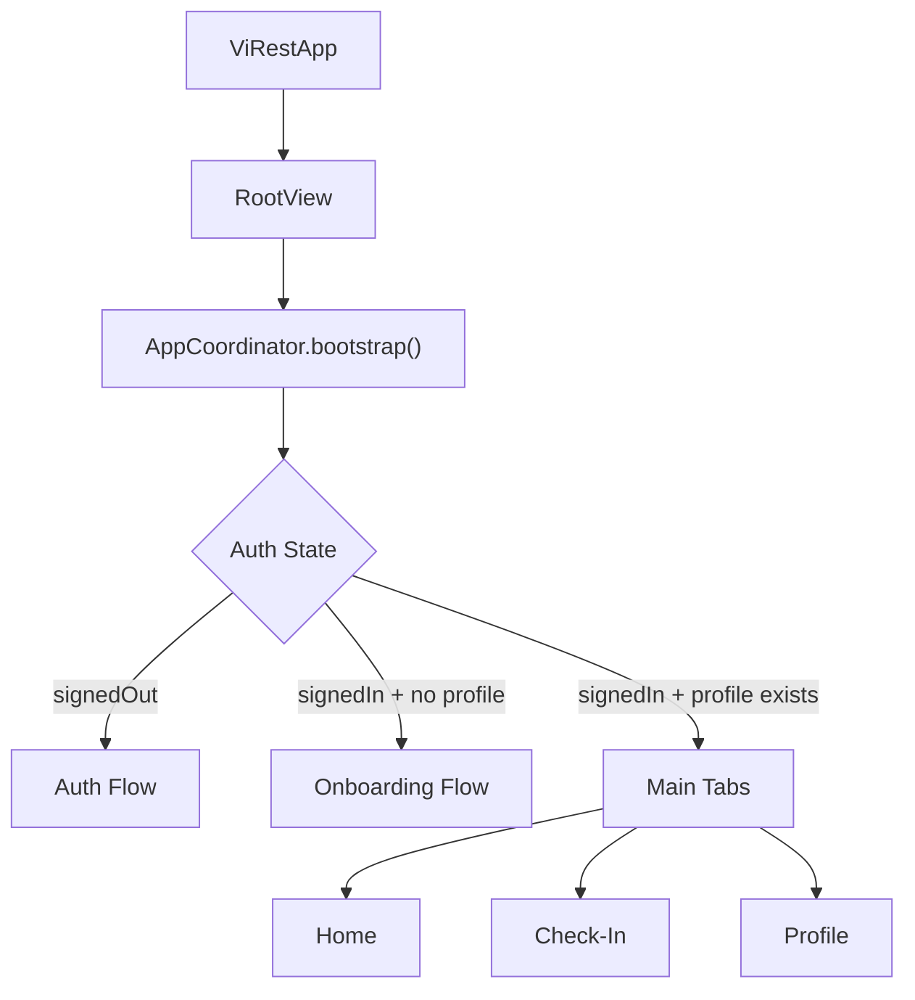
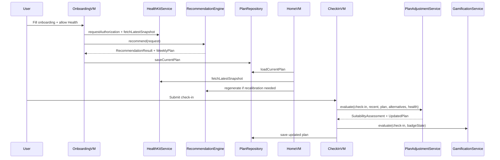

# ViRest Technical Documentation

## 1. Overview

ViRest is an iOS SwiftUI application that recommends sports activities to help users improve resting heart rate (RHR) using:

- User onboarding questionnaire input
- Apple Health / Apple Watch-synced HealthKit data (read on iPhone)
- Rule-based recommendation and plan-adjustment logic

Current product scope is iPhone app only. There is no watchOS companion UI in this phase.

## 2. Technology Stack

- Language: Swift 5
- UI: SwiftUI
- Architecture: MVVM + Coordinator + Dependency Injection
- Persistence: SwiftData (key-value style record + JSON payload)
- Health integration: HealthKit (read)
- Notifications: UserNotifications
- Auth abstraction: Firebase-style service interface (current implementation is placeholder local session persistence)

## 3. Architecture

### 3.1 Layers

- App/Composition:
  - App lifecycle, DI container, route coordinator
- Features:
  - Auth, Onboarding, Home, Check-In, Profile
- Core:
  - Domain models, protocols, shared utilities
- Services:
  - Auth, HealthKit, Recommendation, Plan Adjustment, Notifications, Gamification
- Data:
  - SwiftData store and repositories
- DesignSystem:
  - Shared style components and reusable UI blocks

### 3.2 Dependency Injection

`AppContainer` builds and holds all repositories/services and injects them into ViewModels.

### 3.3 Coordinator Flow



## 4. Project Structure

```text
ViRest/
  App/
  Core/
    Models/
    Protocols/
    Utilities/
  Data/
    Repositories/
    SwiftData/
  DesignSystem/
  Features/
    Auth/
    Onboarding/
    Home/
    CheckIn/
    Profile/
    Main/
  Services/
    Auth/
    Health/
    Recommendation/
    Planning/
    Notification/
    Gamification/
  Resources/
    exercise_seed_data_v2.json
```

## 5. Domain Models

### 5.1 User profile

`UserProfileInput` stores onboarding answers and user context:

- Identity/context: `fullName`, `age`, `gender`
- RHR questionnaire:
  - `questionnaireCurrentRHRBand`
  - `questionnaireTargetRHRGoal` (goal-only for tracking/motivation)
- Body metrics: `heightCm`, `weightKg`
- Safety: `questionnaireHealthConcerns`
- Constraints/preferences:
  - `sessionDuration`, `daysPerWeek`, `preferredTime`
  - `environment`, `questionnaireAccessOptions`
  - `intensityPreference`, `socialPreference`, `consistency`, `cardioExperienceLevel`
- Compliance: `acceptedDisclaimer`

### 5.2 Health snapshot

`HealthSnapshot` includes:

- Steps, active energy, height, weight, BMI
- Resting HR, walking HR average, peak HR, HR recovery, VO2 max
- Data source marker: `healthKit`, `manual`, `mixed`

### 5.3 Recommendation and planning

- `SportRecommendation`: single recommendation result + score + reasons
- `WeeklyPlan`: primary recommendation, alternatives, sessions, notes
- `SessionPlan`: session number, activity, preferred time, planned duration, target RPE
- `SessionCheckIn`: post-activity user confirmation input

### 5.4 Suitability and progression

- `SuitabilityAssessment`: zone (`green/yellow/red`), score, reasons, decision
- `ProgressionDecision`: keep, downgrade, reduce volume, switch alternative, progress

### 5.5 Gamification

- `BadgeState`: completed sessions, streak, level, earned badges
- `ProgressionLevel`: level 1-6 with titles and session thresholds

## 6. Questionnaire-to-Rule Mapping

The onboarding questionnaire is implemented in sectioned steps and mapped to recommendation logic by rule type.

1. Current RHR band
   - Rule: hard filter
   - Mapped to JSON prescription `rhrBand`
2. Target RHR
   - Rule: goal-only (not filter)
3. Preferred environment
   - Rule: hard filter
   - Mapped to JSON `environments`
4. Session duration
   - Rule: soft scoring
   - Mapped to JSON `durationPhases`
5. Weekly frequency
   - Rule: soft scoring
   - Mapped to JSON `frequencyPhases`
6. Access/equipment options
   - Rule: hard filter
   - Mapped to JSON `accessOptions`
7. Health concerns
   - Rule: hard safety filter
   - Mapped to JSON `contraindicationTags`
8. Experience level
   - Rule: soft scoring with higher penalty for high-demand exercises
   - Mapped to JSON `minExperienceLevel`
9. Preferred time
   - Rule: preference-only ranking (not filter)

## 7. Recommendation Engine

`RuleBasedRecommendationEngine` is fully JSON-seed-driven.

### 7.1 Data source

- Loaded from `exercise_seed_data_v2.json` through `ExerciseSeedLoader`
- No hardcoded catalog struct is used for exercise seed content

### 7.2 Processing stages

1. Hard filters:
   - RHR band match
   - Environment compatibility
   - Access/equipment compatibility
   - Contraindication exclusion
2. Soft scoring:
   - Duration fit
   - Frequency fit
   - Experience fit
3. Preference-only ranking:
   - Preferred exercise time
4. Goal-only:
   - Target RHR stored in notes/tracking context only

### 7.3 Empty-result prevention

- If strict hard filter returns empty due access mismatch, engine relaxes access constraint while keeping safety and eligibility checks.
- Duration/frequency are overlap-based soft similarity; no exact hard reject.

### 7.4 Score composition

`totalScore = hard * 60 + duration * 18 + frequency * 14 + experience * 6 + preferredTime * 2`

The engine returns:

- Primary recommendation
- Top alternatives
- Auto-generated weekly sessions (count capped by both goal and user availability)

### 7.5 Output explainability

Each recommendation includes reasons:

- RHR match
- Environment/access fit
- Safety/conflict result
- Duration fit
- Frequency fit
- Experience fit

## 8. HealthKit Integration

### 8.1 Authorization and read scope

Reads:

- `stepCount`
- `activeEnergyBurned`
- `height`
- `bodyMass`
- `restingHeartRate`
- `walkingHeartRateAverage`
- `heartRate` (for peak)
- `vo2Max`
- `heartRateRecoveryOneMinute`
- Characteristics: date of birth, biological sex

### 8.2 Import behavior

- On onboarding health step, consent is requested automatically.
- If data exists, fields are prefilled (age, gender, height, weight, current RHR band).
- If unavailable/denied, app continues with manual fallback values.

### 8.3 Apple Watch relationship

No watchOS app UI is required for MVP.
Apple Watch metrics are consumed via HealthKit sync on iPhone.

## 9. Onboarding Flow

### 9.1 Step sequence

1. Health sync
2. Physiological
3. Health safety
4. Time constraint
5. Environment
6. Preferences
7. Weekly goal + disclaimer

### 9.2 Mandatory validation (current implementation)

- Height > 0
- Weight > 0
- At least one health concern selection
- At least one access option
- Disclaimer accepted

### 9.3 Save and generation flow

On submit:

1. Save profile
2. Save weekly goal
3. Fetch latest health snapshot
4. Generate recommendation
5. Save current weekly plan
6. Request notification permission and schedule reminders

## 10. Home/Recalibration Behavior

`HomeViewModel` recalibrates plan when:

- No current plan exists
- Plan age >= 7 days
- Weekly adherence < 40%
- Resting HR trend is elevated (>= 85 bpm)

Recalibration re-runs recommendation using latest profile + health snapshot.

## 11. Check-In and Plan Adjustment

### 11.1 Check-in input

User confirms completed activity and submits:

- Perceived difficulty
- Fatigue level
- Pain level
- Discomfort areas (only if pain is not "no pain")
- Optional notes

### 11.2 Adjustment engine

`RuleBasedPlanAdjustmentService` rules:

- Red triggers:
  - Moderate/strong pain
  - Too exhausting
  - Breathing discomfort
- Repeated over-fatigue
- Repeated easy/no pain sessions

Decisions:

- Keep
- Downgrade intensity
- Reduce volume
- Switch to alternative recommendation
- Progress gradually

## 12. Gamification

`GamificationService` updates:

- Completed session count
- Daily streak
- Level progression by session threshold
- Badges:
  - First check-in
  - 3-day streak
  - 10-session consistency

Appreciation message is generated after each check-in based on current level.

## 13. Notifications

`UserNotificationService` provides:

- Weekly pending-target reminder (repeating time based on preferred time)
- Immediate positive notification after check-in completion
- Reminder cleanup and rescheduling on plan updates

## 14. Persistence Strategy

### 14.1 Store design

- SwiftData entity `KeyValueRecord` (`key`, `payload`, `updatedAt`)
- Generic `SwiftDataKeyValueStore` encodes/decodes domain models as JSON blob

### 14.2 Keys

- `user_profile`
- `weekly_goal`
- `current_plan`
- `check_ins`
- `badge_state`

### 14.3 Repositories

- UserProfile repository
- Plan repository
- CheckIn repository
- BadgeState repository

## 15. Authentication

Auth interface follows `AuthProviding`.

Current concrete implementation (`FirebaseAuthService`) is placeholder/local:

- Stores a serialized `AuthUser` in `UserDefaults`
- Exposes Apple/Google sign-in methods
- Production Firebase SDK integration is not yet wired

## 16. Design System

Custom SwiftUI design primitives:

- Gradient atmospheric background with animated aurora circles
- SurfaceCard (glassmorphism-like)
- Primary/secondary buttons
- Chip controls (single/multi-select)
- Shared typography (`AvenirNext`) and palette tokens
- Weekly goal selector with light-themed bottom sheet wheel picker

## 17. Configuration and Permissions

### 17.1 Entitlements

- Sign in with Apple
- HealthKit capability

### 17.2 Info.plist keys (from project build settings)

- `NSHealthShareUsageDescription`
- `NSHealthUpdateUsageDescription`

## 18. Build and Run

### 18.1 Requirements

- Xcode with iOS Simulator support
- Valid signing/team settings for your environment

### 18.2 Build command

```bash
xcodebuild -scheme ViRest -destination 'platform=iOS Simulator,name=iPhone 17' build
```

## 19. Known Limitations and Technical Notes

1. Auth service is placeholder, not yet connected to real Firebase/Auth SDK flows.
2. `SessionCheckIn` still stores `actualDurationMinutes`, currently filled from planned duration.
3. `SessionPlan.scheduledDay` is retained as legacy compatibility field but not used in current UX.
4. `ExerciseSeedLoader` has a local fallback path to `/Users/tomoya/Downloads/...` that should be removed for production packaging.
5. `SessionDurationOption` case names are legacy-labeled, while displayed options and engine mapping already follow current questionnaire labels.
6. Availability defaults are used if some questionnaire values are absent in older stored profiles.

## 20. Extension Guide

### 20.1 Add new exercise recommendations

1. Update `Resources/exercise_seed_data_v2.json`
2. Ensure new item has:
   - `rhrBand`
   - `environments`
   - `accessOptions`
   - `contraindicationTags`
   - phases for intensity, duration, frequency
3. If needed, map new `seedID` to app `ActivityType` label in engine.

### 20.2 Adjust scoring policy

Tune weight constants in `RuleBasedRecommendationEngine`:

- Hard filter contribution
- Duration/frequency/experience weights
- Soft-floor behavior for small candidate sets

### 20.3 Evolve adjustment policy

Modify `RuleBasedPlanAdjustmentService` thresholds for:

- Red trigger criteria
- Over-fatigue/easy repetition window
- Volume/intensity progression percentages

## 21. High-Level Data Flow



---

If you want, next step can be a "Developer Handbook v2" version that includes:

- exact API contract examples for each protocol
- JSON schema documentation for `exercise_seed_data_v2.json`
- migration checklist for production launch (Firebase + analytics + tests + CI/CD)
