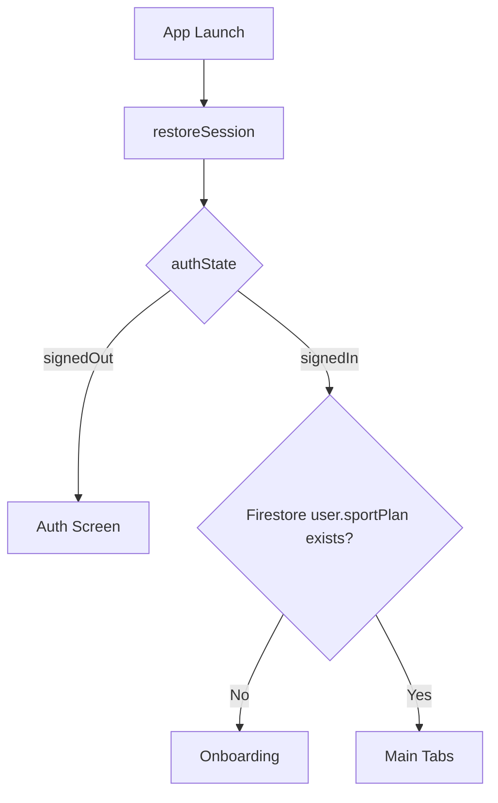

# ViRest Technical Documentation (Updated)

Dokumen ini merepresentasikan implementasi **saat ini** di branch terbaru setelah integrasi Firebase + revisi flow onboarding.

## 1. Ringkasan Aplikasi

ViRest adalah aplikasi iOS (SwiftUI) untuk membantu user meningkatkan kondisi kardio secara bertahap melalui:

- Auth (Apple / Google) berbasis Firebase
- Onboarding question flow (single-screen, data-driven step)
- Integrasi HealthKit (opsional, dengan prompt saat step pertama)
- Rekomendasi olahraga berbasis rule engine
- Tracking check-in dan progres title/badge

## 2. Tech Stack

- Language: Swift 5
- UI: SwiftUI
- Arsitektur: MVVM + Coordinator + Dependency Injection
- Backend: Firebase Auth + Cloud Firestore
- Local persistence: SwiftData (key-value JSON records)
- Health data: HealthKit (read)
- Notifications: UserNotifications

## 3. Arsitektur Tingkat Tinggi

### 3.1 Layer

- `App/`: composition root, coordinator, dependency container
- `Features/`: Auth, Onboarding, Home, Profile, Main tabs
- `Services/`: Auth, Health, Recommendation, Planning, Notification, Gamification
- `Data/`: Firestore models/repository + SwiftData repositories
- `Core/`: domain model, protocol, utility
- `DesignSystem/`: shared palette, typography, reusable styles/components

### 3.2 Dependency Injection

Semua dependency dibuat di `AppContainer`:

- Auth: `FirebaseAuthService`
- Firestore: `FirestoreUserRepository`
- Health: `HealthKitService`
- Recommendation: `RuleBasedRecommendationEngine`
- Notifications: `UserNotificationService`
- Local repos (SwiftData): profile/plan/check-in/badge

## 4. App Route Flow

Source of truth: `AppCoordinator`.



Perilaku penting:

- Fresh app open + belum login: ke **Auth**.
- Login sukses + belum punya `sportPlan`: ke **Onboarding**.
- Login sukses + sudah punya `sportPlan`: ke **Main**.
- App ditutup saat onboarding (belum complete), lalu dibuka lagi: kembali ke **Onboarding** (karena `sportPlan` belum ada).
- Tombol back di pertanyaan pertama onboarding: trigger exit onboarding via sign-out, kembali ke **Auth**.

## 5. Auth

Implementasi di `FirebaseAuthService`:

- `signInWithApple()`
- `signInWithGoogle()`
- `restoreSession()` dari `UserDefaults`
- `signOut()`

Setelah sign-in, `AuthViewModel` memanggil `FirestoreUserRepository.ensureUserExists(authUser:)` untuk memastikan dokumen user tersedia di Firestore.

Catatan:

- Tidak ada halaman register terpisah; flow saat ini menggunakan federated sign-in (Apple/Google).

## 6. Onboarding (Current Implementation)

### 6.1 Konsep UI + Navigasi

- Tetap satu tampilan onboarding (`OnboardingView`) dengan `currentStep` enum.
- Data pertanyaan berubah per-step, **layout tetap**.
- `Next` pindah ke pertanyaan berikutnya.
- `Back` pindah ke pertanyaan sebelumnya.
- Jika `Back` pada step pertama, keluar onboarding (kembali ke auth via coordinator flow).

### 6.2 Section dan Pertanyaan (5 section, 10 pertanyaan)

1. **Current Health Baseline**
1. `currentRHR`
1. `weight`
1. `height`

2. **Exercise Preference**
1. `environment`
1. `preferredTime`

3. **Exercise Availability & Commitment**
1. `duration`
1. `frequency`
1. `equipment` (multi-select)

4. **Safety Screening**
1. `contraindications` (multi-select)

5. **Goal Setting**
1. `targetRHR`

### 6.3 HealthKit Prompt Behavior

Saat user masuk step pertama (`currentRHR`):

- App cek `shouldPresentAuthorizationPrompt()`.
- Jika status HealthKit memang masih perlu request, tampil alert konfirmasi.
- Jika user pilih izinkan, app langsung request authorization HealthKit.
- Jika authorization sudah pernah diberikan dan status `unnecessary`, prompt tidak muncul lagi.

### 6.4 Validasi Input

- Berat (`weightKgText`) wajib angka > 0.
- Tinggi (`heightCmText`) wajib angka > 0.
- Guard range submit:
  - Height: 80...250 cm
  - Weight: 20...400 kg
- Multi-select concern dan access dinormalisasi (`none` mutual-exclusion).

Regex guard (on input):

- Weight: `^[0-9]{0,3}(?:\.[0-9]{0,1})?$`
- Height: `^[0-9]{0,3}$`

Error message ditampilkan di bawah judul pertanyaan.

### 6.5 Submit Flow Onboarding

`submitAndCompleteIfValid()` melakukan:

1. Validasi mandatory input
2. Build `UserProfileInput`
3. Simpan profile + weekly goal ke local SwiftData
4. Generate sport plan top-3 untuk Firestore (`sports.json`)
5. Save profile + sport plan ke Firestore
6. Generate weekly plan lokal via recommendation engine (`exercise_matrix_v4_flat.json`)
7. Schedule notification reminder
8. Jika sukses, callback completion ke `AppCoordinator.didCompleteOnboarding()`

## 7. Data Model Penting

### 7.1 Firestore `users`

Field utama (ringkas):

- `id`, `email`, `displayName`
- `age`
- `restingHeartRate`
- `targetRestingHeartRate`
- `currentTitleId`
- `totalActionsCompleted`
- `sportPlan`
- `createdAt`, `lastActiveAt`

`users/{uid}/checkIns` subcollection dipakai untuk histori check-in.

### 7.2 Firestore `titles`

- `name`
- `minTotalActionsRequired`
- `displayOrder`

### 7.3 Local SwiftData Keys

- `user_profile`
- `weekly_goal`
- `current_plan`
- `check_ins`
- `badge_state`

## 8. Recommendation Engine

Implementasi: `RuleBasedRecommendationEngine`.

Sumber data: `exercise_matrix_v4_flat.json`.

Pipeline:

1. Hard filters:
- environment
- RHR band
- BMI rule
- contraindication check

2. Relaxation strategy bila kandidat kosong:
- relax BMI
- relax RHR + BMI
- relax strict equipment compatibility
- safety fallback (kandidat konflik paling minimal)

3. Scoring:

- `hardQuality * 62`
- `durationScore * 16`
- `frequencyScore * 12`
- `equipmentScore * 8`
- `preferredTimeScore * 2`

Output:

- primary recommendation
- alternatives
- weekly sessions (dibatasi goal + availability user)
- plan notes (menjelaskan fallback/relaxation jika terjadi)

## 9. Home, Check-In, Profile

### 9.1 Home

- Load user dan `sportPlan` dari Firestore.
- Tampilkan kartu sport mingguan + progress completed/target.
- Weekly counter di-reset saat ganti minggu (`weekResetDate`).

### 9.2 Check-In

Dari Home, user tap `+` pada sport:

1. Confirmation dialog
2. Bottom sheet check-in form
3. Submit:
- increment `totalActionsCompleted`
- increment `completedThisWeek` untuk sport terkait
- simpan history check-in
- evaluate title upgrade
- evaluate badge/gamification
- generate suitability assessment (green/yellow/red)

### 9.3 Profile

- Menampilkan user data (local + firestore)
- Menampilkan title progression
- Menampilkan check-in history
- Weekly goal currently locked post-onboarding

## 10. Notification

`UserNotificationService`:

- Permission request
- Plan reminder berdasarkan preferred time
- Target achieved notification setelah check-in
- Support reminder per sport + mid-week nudge

## 11. Design System

- Typography: AvenirNext family
- Palette: `richBlack`, `vibrantGreen`, `slateGray`
- Reusable style: `SurfaceCard`, button styles, gradient background
- Onboarding mempertahankan layout existing; update fokus di logic/nav/data

## 12. Resource Files

- `ViRest/sports.json`
  - dipakai `SportsCatalogLoader` untuk generate Firestore sport plan saat onboarding
- `ViRest/Resources/exercise_matrix_v4_flat.json`
  - dipakai `RuleBasedRecommendationEngine` untuk weekly recommendation plan lokal

## 13. Permissions & Capability

- HealthKit capability (`ViRest.entitlements`)
- Info plist keys via build settings:
- `NSHealthShareUsageDescription`
- `NSHealthUpdateUsageDescription`

## 14. Build & Run

Prerequisites:

- Xcode terbaru dengan iOS Simulator
- Firebase project config yang valid (termasuk setup app + auth providers)
- Firestore collections minimal: `users`, `titles`

Build command:

```bash
xcodebuild -project "ViRest.xcodeproj" -scheme "ViRest" -destination 'platform=iOS Simulator,name=iPhone 17' build
```

## 15. Known Technical Notes

1. Onboarding menyimpan dua jenis output plan:
- Firestore plan (`sports.json`) untuk tampilan main app
- WeeklyPlan local (`exercise_matrix_v4_flat.json`) untuk engine + reminder context

2. Session restore auth state saat ini berbasis local persisted auth user + active flag.

3. Fallback path lokal di loader (`/Users/tomoya/Downloads/...`) masih ada dan sebaiknya dibersihkan untuk produksi.

## 16. File Map (Quick Reference)

- App route: `ViRest/App/AppCoordinator.swift`
- Root composition: `ViRest/App/RootView.swift`
- DI container: `ViRest/App/AppContainer.swift`
- Auth service: `ViRest/Services/Auth/FirebaseAuthService.swift`
- Onboarding UI: `ViRest/Features/Onboarding/OnboardingView.swift`
- Onboarding VM: `ViRest/Features/Onboarding/OnboardingViewModel.swift`
- Firestore repo: `ViRest/Data/Repositories/FirestoreUserRepository.swift`
- Recommendation engine: `ViRest/Services/Recommendation/RuleBasedRecommendationEngine.swift`
- Home VM: `ViRest/Features/Home/HomeViewModel.swift`
- Check-in VM: `ViRest/Features/Home/CheckInSheetViewModel.swift`
- Profile VM: `ViRest/Features/Profile/ProfileViewModel.swift`

